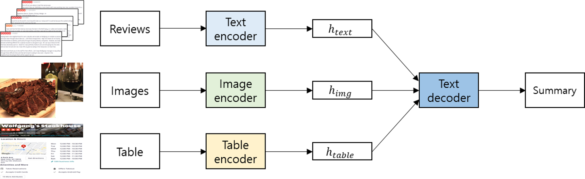

# Self-Supervised Multimodal Opinion Summarization

Official Pytorch implementation of the paper: ["Self-Supervised Multimodal Opinion Summarization"](https://aclanthology.org/2021.acl-long.33), ACL-IJCNLP, 2021.

<p align="center">

</p>

## Abstract
Recently, opinion summarization, which is the generation of a summary from multiple reviews, has been conducted in a self-supervised manner by considering a sampled review as a pseudo summary. However, non-text data such as image and metadata related to reviews have been considered less often. To use the abundant information contained in non-text data, we propose a self-supervised multimodal opinion summarization framework called MultimodalSum. Our framework obtains a representation of each modality using a separate encoder for each modality, and the text decoder generates a summary. To resolve the inherent heterogeneity of multimodal data, we propose a multimodal training pipeline. We first pretrain the text encoder–decoder based solely on text modality data. Subsequently, we pretrain the non-text modality encoders by considering the pretrained text decoder as a pivot for the homogeneous representation of multimodal data. Finally, to fuse multimodal representations, we train the entire framework in an end-to-end manner. We demonstrate the superiority of MultimodalSum by conducting experiments on Yelp and Amazon datasets.

## Usage

### Install dependencies

The easiest way to proceed is to create a separate conda environment.

```
conda create -n multimodalsum python=3.7.7
conda activate multimodalsum
```

Install required modules.

```
pip install -r requirements.txt
```

### Download data

Our model is trained and evaluated on two review datasets: Yelp and Amazon.

#### Training data

##### Yelp

1. Download JSON and Photos from [link](https://www.yelp.com/dataset/download)
2. Unzip JSON
	1. Put yelp_academic_dataset_reviews to *data/yelp/raw/* and name it *reviews.json*
	2. Put yelp_academic_dataset_business to *data/yelp/raw_others/* and name it *business.json*
3. Put Photos to *data/yelp/raw_others/*

##### Amazon

1. Download per-category reviews and metadata from [link](http://jmcauley.ucsd.edu/data/amazon/links.html)
2. Put reviews to *data/amazon/raw/*
3. Unzip metadata and put them to *data/amazon/raw_others/*

#### Evaluation data

Evaluation data are located at *data/yelp/test/* and *data/amazon/test/*

##### Yelp

Data are downloaded from [link](https://github.com/sosuperic/MeanSum) and some missing or mismatched business ids are fixed.

##### Amazon

Data are downloaded from [link](https://github.com/abrazinskas/Copycat-abstractive-opinion-summarizer/tree/master/gold_summs).

### Preprocess data

Text data are tokenized, subsampled, and partitioned in order. Data preprocessing scripts are based on [link](https://github.com/abrazinskas/Copycat-abstractive-opinion-summarizer/tree/master/preprocessing) and some scripts are edited.

From the root directory, execute the following command.

```
python -m luigi
--local-scheduler
--module preprocessing.steps Partition
--inp-dir-path=data/yelp/raw
--Subsample-min-revs=10
--Subsample-min-rev-len=35
--Subsample-max-rev-len=100
--Subsample-percentile=90
--train-part=0.9
--val-part=0.1
--GlobalConfig-out-dir-path=data/
--GlobalConfig-dataset=yelp
--log-level=INFO
--workers=4
```

```
python -m luigi
--local-scheduler
--module preprocessing.steps Partition
--inp-dir-path=data/amazon/raw
--Subsample-min-revs=10
--Subsample-min-rev-len=45
--Subsample-max-rev-len=70
--Subsample-percentile=90
--train-part=0.95
--val-part=0.05
--GlobalConfig-out-dir-path=data/
--GlobalConfig-dataset=amazon
--log-level=INFO
--workers=4
```

### Multimodal preprocess data

Text, Image, and Table data for multimodal learning are prepared. 

From the root directory, execute the following command.

```
python multimodal_preprocessing/multimodal_preprocessing.py --dataset yelp
python multimodal_preprocessing/multimodal_preprocessing.py --dataset amazon
```

### Model train (multimodal training pipeline)

MultimodalSum consists of text encoder, image encoder, table encoder, and text decoder. 
- Text encoder and decoder are based on [BART](https://aclanthology.org/2020.acl-main.703/) and implemented based on the [Transformers](https://huggingface.co/transformers/model_doc/bart.html) library from [Hugging Face](https://huggingface.co/). 
- Image encoder is based on [ResNet101](https://pytorch.org/hub/pytorch_vision_resnet/).
- Table encoder is based on [data-to-text research](https://ojs.aaai.org/index.php/AAAI/article/view/4668).

To resolve the inherent heterogeneity of multimodal data, MultimodalSum is trained along the multimodal training pipeline. Multimodal training pipeline consists of three steps.
- Text modality pretraining (Pretrain text encoder and decoder)
- Other modalities pretraining
	- Img modality pretraining (Pretrain image encoder)
	- Table modality pretraining (Pretrain table encoder)
- Multiple modalities training (Train MultimodalSum)

From the root directory, execute the following command.

```
# 0) Further pretrain BART using the entire training review corpus
python src/bart-review.py

# 1) Text modality pretraining
OMP_NUM_THREADS=1 python -m torch.distributed.launch --nproc_per_node=4 src/text_pretrain.py

# 2) Other modalities pretraining
OMP_NUM_THREADS=1 python -m torch.distributed.launch --nproc_per_node=2 src/img_pretrain.py
OMP_NUM_THREADS=1 python -m torch.distributed.launch --nproc_per_node=2 src/table_pretrain.py

# 3) Multiple modalities training
OMP_NUM_THREADS=1 python -m torch.distributed.launch --nproc_per_node=8 src/multimodal_train.py
```
Model weights are saved in *ckpt/* and log files are saved in *log/*.

### Model evaluation

From the root directory, execute the following command.

```
python src/test.py
```

## Generated summaries

Generated summaries from MultimodalSum on Yelp and Amazon test data are included in *output/*.

## Citation

```
@inproceedings{im-etal-2021-self,
    title = "Self-Supervised Multimodal Opinion Summarization",
    author = "Im, Jinbae  and
      Kim, Moonki  and
      Lee, Hoyeop  and
      Cho, Hyunsouk  and
      Chung, Sehee",
    booktitle = "Proceedings of the 59th Annual Meeting of the Association for Computational Linguistics and the 11th International Joint Conference on Natural Language Processing (Volume 1: Long Papers)",
    month = aug,
    year = "2021",
    address = "Online",
    publisher = "Association for Computational Linguistics",
    url = "https://aclanthology.org/2021.acl-long.33",
    doi = "10.18653/v1/2021.acl-long.33",
    pages = "388--403"
}
```